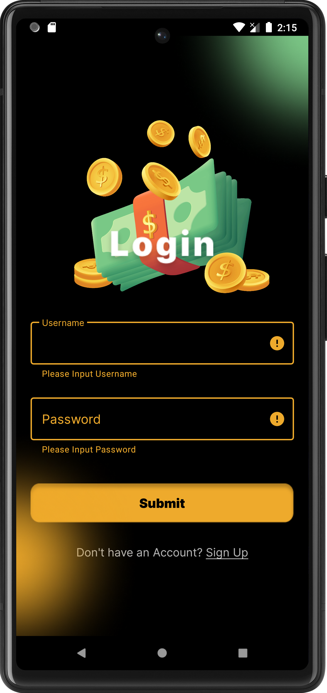
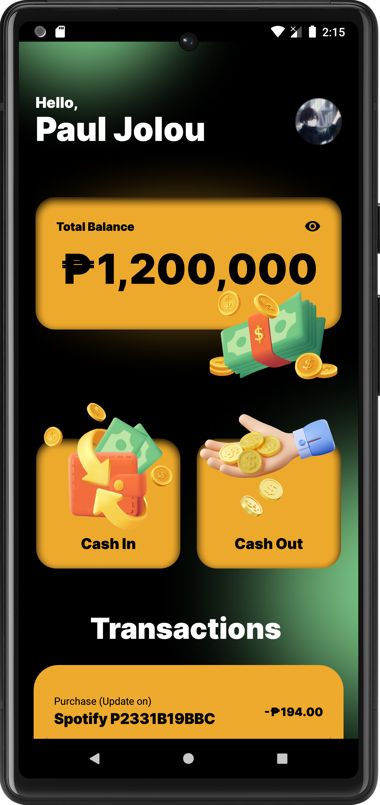
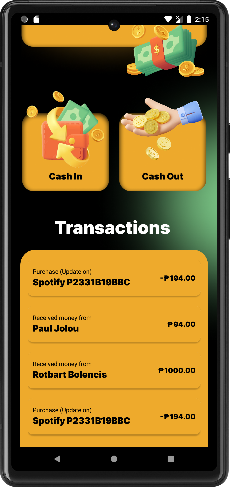

# Jolou Pay 💰
A Task Performance in Mobile Systems and Technologies that aims to design the layout for an electronic money app.

	
	
	
	
	

## Contribution 🔥

If you wish to help improve this project, fork this repo and submit your own pull request. If you discover a problem with this project, please report it to the issue page. Thank you very much 😊.

## Thank you 😃

If you like this project just click ⭐ and share it with others.